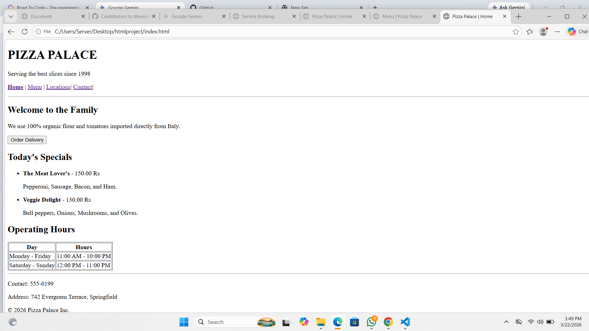
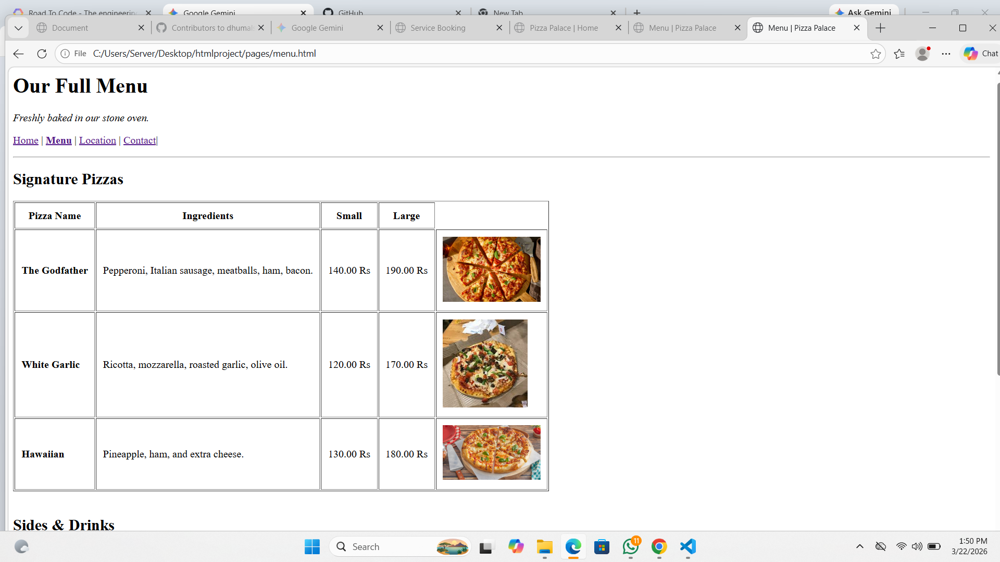
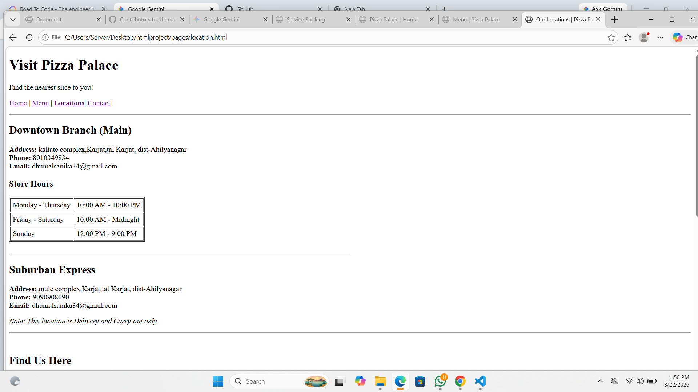
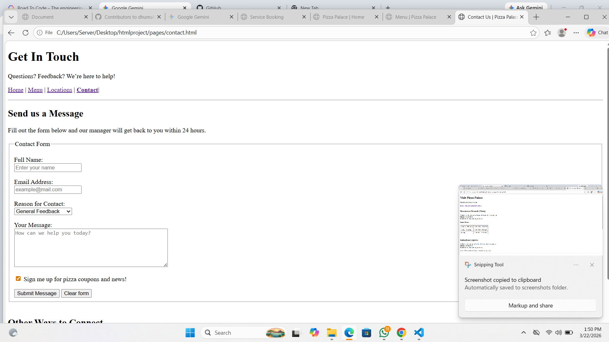

# 🍕 Pizza Palace - Artisanal Pizza Website

Welcome to the **Pizza Palace** web project! This is a clean, multi-page business website built using semantic **HTML5**. It is designed to be lightweight, easy to navigate, and fully functional for a local pizza shop.

## 🚀 Project Overview
This project serves as a digital storefront for a pizza business, allowing customers to view the menu, find physical store locations, and send inquiries through a contact form.

### 📄 Pages Included:
1.  **Home Page (`index.html`):** Features a hero section, best-selling pizzas, and business hours.
2.  **Menu Page (`menu.html`):** A detailed pricing table for signature pizzas, sides, and drinks, including a basic order form.
3.  **Locations Page (`locations.html`):** Lists multiple branches with contact details and an embedded Google Map.
4.  **Contact Page (`contact.html`):** A comprehensive inquiry form with a newsletter opt-in and a mini FAQ section.

## 🛠️ Built With
* **HTML5:** Semantic structure (`<header>`, `<nav>`, `<main>`, `<section>`, `<footer>`).
* **CSS3:** Internal styling for responsive layouts and modern typography.
* **Google Maps Embed:** Integrated iFrame for live location tracking.
## output:






## 📂 Folder Structure
To run this project correctly, ensure your files are organized like this:
```text
/pizza-shop-project
│
├── index.html       # The main home page
├── menu.html        # Menu and pricing
├── locations.html   # Store locations and maps
├── contact.html     # Contact form and FAQ
└── README.md        # Project documentation
 